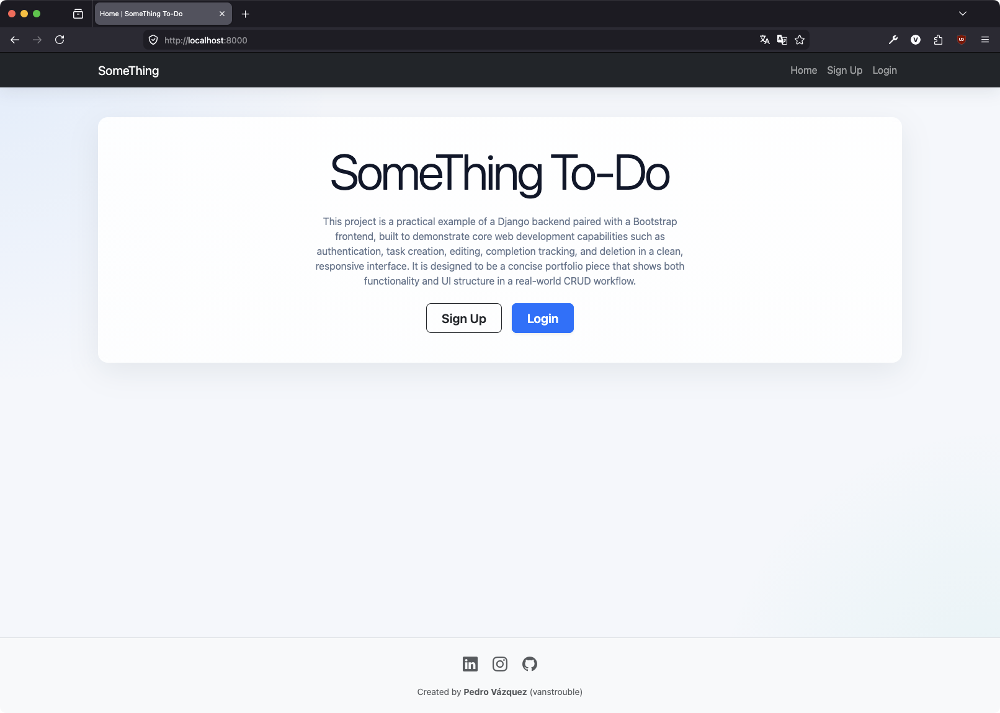
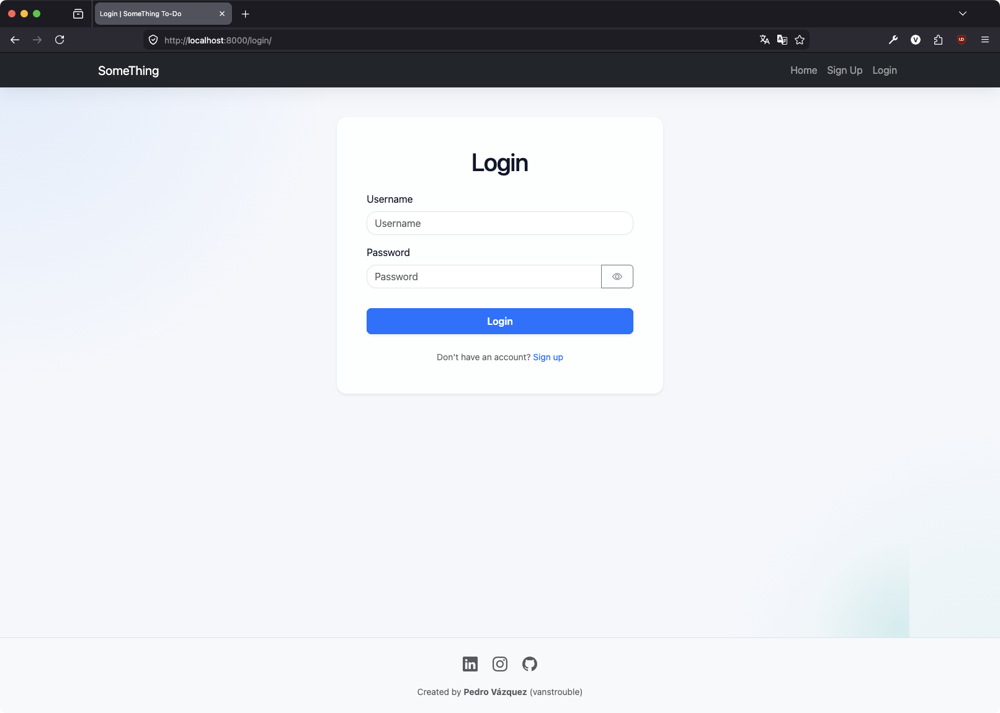
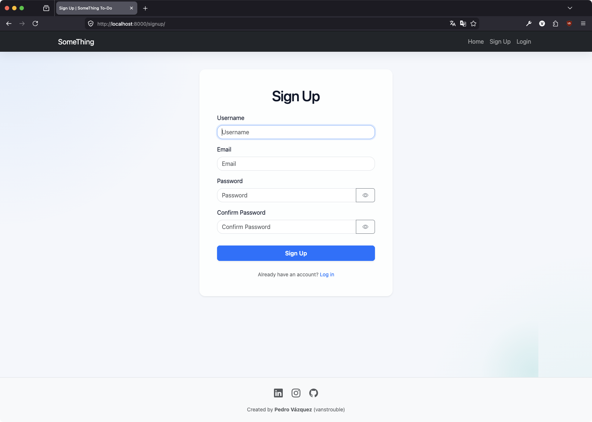
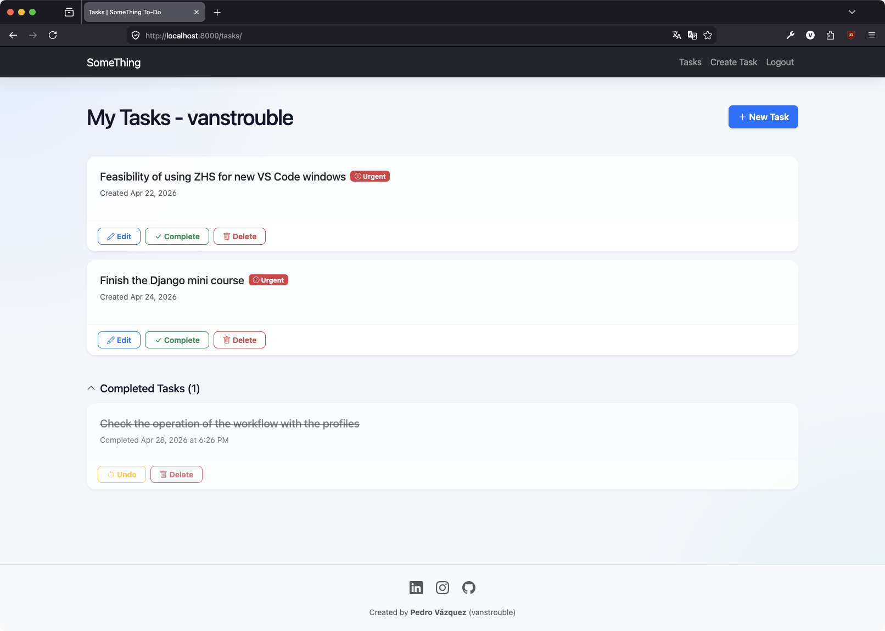
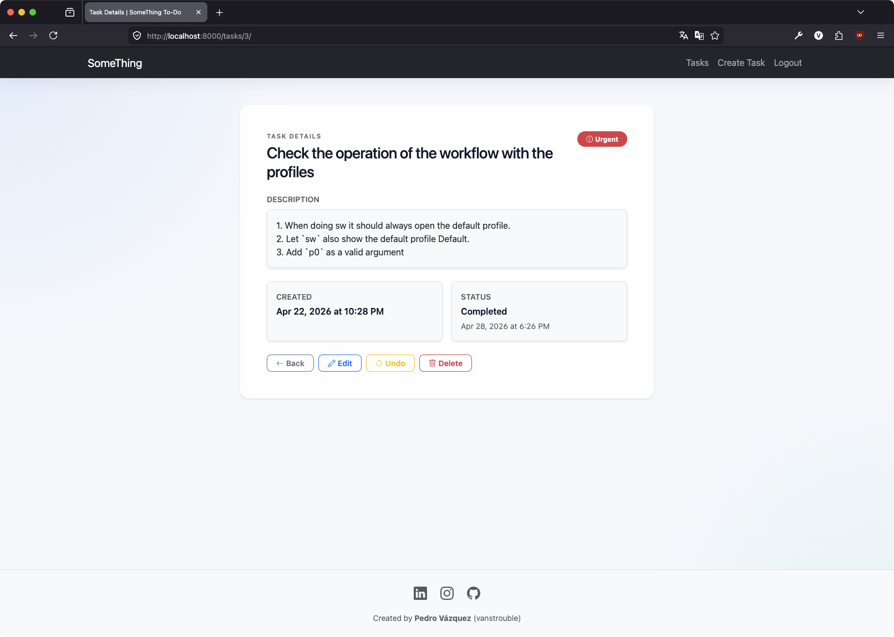
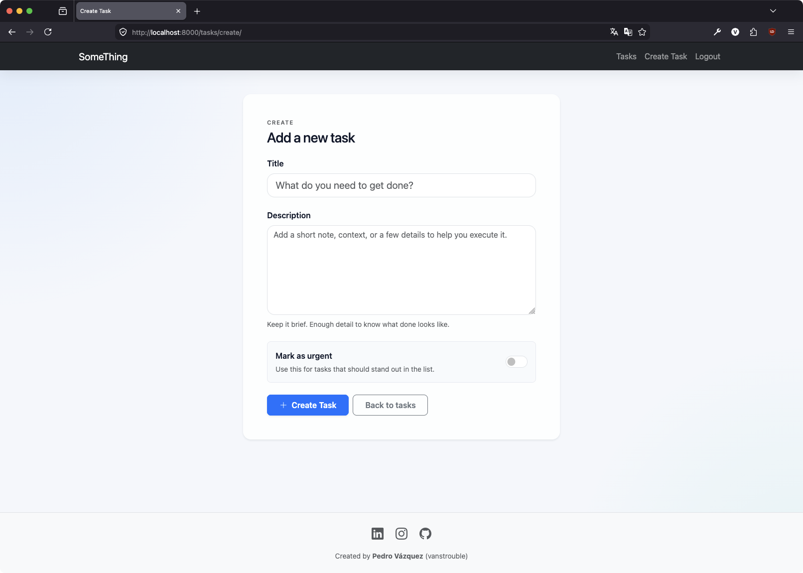

# SomeThing To-Do | Django Crud Auth

Simple Django practice project focused on authentication and task management, inspired by Things 3 for macOS as a simplified version of that workflow.

## Overview

This app is a small but complete to-do workflow built with Django and Bootstrap, based on the Things 3 experience from macOS in a simpler form. It lets each user create an account, log in, manage personal tasks, mark them as completed, and delete them when needed.

The goal of the project is to practice core Django concepts:

- URL routing
- Views and templates
- Forms and custom authentication
- Models and user relationships
- Static files and responsive UI styling

## Tech Stack

- Python
- Django
- SQLite
- Bootstrap

## Project Structure

- `manage.py`: Django management entry point
- `djangocrud/`: project settings and root URL configuration
- `task/`: app with models, views, forms, templates, and static files
- `db.sqlite3`: local database created after migrations
- `screenshots/`: UI captures used in this README

## Main Features

- User signup and login
- Logout support
- Create tasks with title, description, and urgency flag
- View active and completed tasks separately
- Task detail page with edit, complete, undo, and delete actions
- Personalized task list for the authenticated user

## How to Run Locally

### 1. Clone the repository

```bash
git clone https://github.com/vanstrouble/something-todo-django-project.git
cd django-crud-auth
```

### 2. Create and activate a virtual environment

macOS/Linux:

```bash
python3 -m venv .venv
source .venv/bin/activate
```

Windows (PowerShell):

```powershell
python -m venv .venv
.venv\Scripts\Activate.ps1
```

### 3. Install dependencies

```bash
pip install django
```

### 4. Run migrations

```bash
python manage.py migrate
```

This command creates `db.sqlite3` automatically if it does not exist.

### 5. Start the development server

```bash
python manage.py runserver
```

Open in browser:

- `http://127.0.0.1:8000/`

## Main Routes

- `/` Home
- `/signup/` Sign up
- `/login/` Log in
- `/logout/` Log out
- `/tasks/` Task list
- `/tasks/create/` Create task
- `/tasks/<id>/` Task details
- `/tasks/<id>/toggle-complete/` Mark task complete or undo
- `/tasks/<id>/delete/` Delete task

## Screenshots

### Home

<p>
	
</p>

Landing page with a short introduction and quick access to sign up or log in.

### Login

<p>
	
</p>

Authentication form for existing users.

### Sign Up

<p>
	
</p>

Registration form with username, email, password, and password confirmation.

### Tasks List

<p>
	
</p>

Shows active tasks and a separate completed tasks section for the logged-in user.

### Task Details

<p>
	
</p>

Displays task information and actions to edit, complete, undo, or delete the task.

### Create Task

<p>
	
</p>

Form to create a new task with title, description, and urgent flag.

## Notes

- This is a learning project focused on Django fundamentals and a clean UI.
- The interface uses Bootstrap components and custom styling for a polished task app experience.
